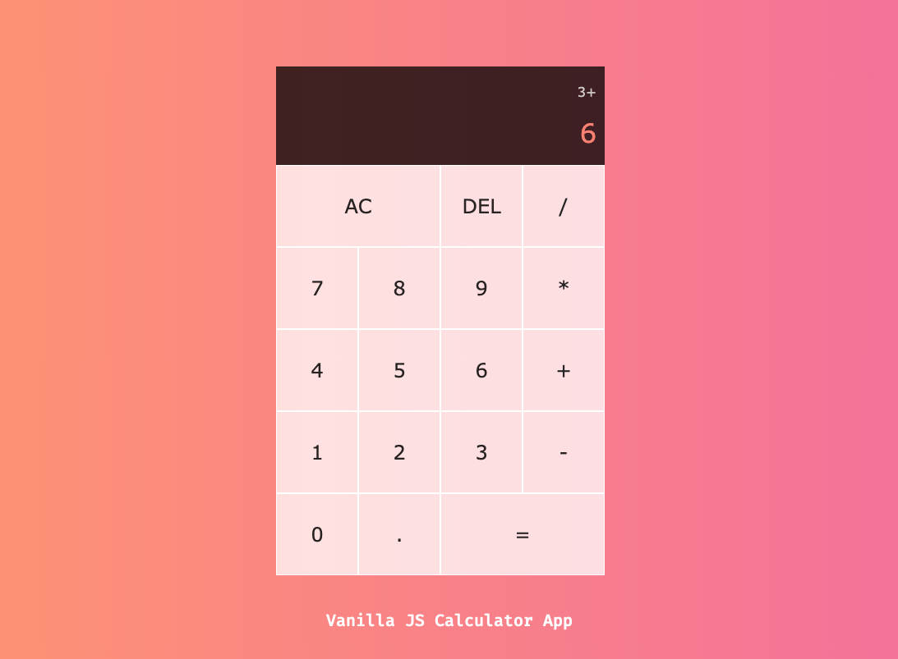

# Vanilla Javascript Calculator App

Checkout the project [HERE](https://shrki416.github.io/Calculator-App/)

Classic calculator app developed entirely in pure **JavaScript**, **HTML** and **CSS**.

## Summary

Creating this application was great to my development as a developer. This application forced me to think like a programmer. After learning JavaScript I wanted to continue the learning process by building an application to showcase my skill, hence this application. Although a small application, simple in concept it was a great learning opportunity for me as new dev.

It took me about a month to complete and work through all functionality needed. I learned a ton about problem solving and working with different aspects of JavaScript. It was certainly challenging, but worth every moment :)

### Author

- Ahmed Abdelaal - [Website](https://aa-dev.io/) | [LinkedIn](https://www.linkedin.com/feed/)
